# MUG-V 10B: High-efficiency Training Pipeline for Large Video Generation Models

<div align="center">

**[Yongshun Zhang](yongshun.zhang@shopee.com)\* · [Zhongyi Fan](zhongyi.fan@shopee.com)\* · [Yonghang Zhang](yonghang.zhang@shopee.com) · [Zhangzikang Li](zhangzikang.li@shopee.com) · [Weifeng Chen](weifeng.chen@shopee.com)**

**[Zhongwei Feng](zhongwei.feng@shopee.com) · [Chaoyue Wang](daniel.wang@shopee.com)† · [Peng Hou](peng.hou@shopee.com)† · [Anxiang Zeng](zeng0118@e.ntu.edu.sg)†**

LLM Team, Shopee Pte. Ltd.

\* Equal contribution · † Corresponding authors

[](#)
[](https://huggingface.co/MUG-V/MUG-V-inference)
[](https://github.com/Shopee-MUG/MUG-V) 
[](https://github.com/Shopee-MUG/MUG-V-Megatron-LM-Training)
[](https://github.com/Shopee-MUG/MUG-V/blob/main/LICENSE)

</div>


## Overview

**MUG-V 10B** is a large-scale video generation system built by the **Shopee Multimodal Understanding and Generation (MUG) team**. The core generator is a Diffusion Transformer (DiT) with ~10B parameters trained via flow-matching objectives. We release the complete stack:
- [**Model weights**](https://huggingface.co/MUG-V/MUG-V-inference)
- [**Megatron-Core-based training code**](https://github.com/Shopee-MUG/MUG-V-Megatron-LM-Training)
- [**Inference pipelines**](https://github.com/Shopee-MUG/MUG-V) for **video generation** and **video enhancement**

To our knowledge, this is the first publicly available large-scale video-generation training framework that leverages **Megatron-Core** for high training efficiency (e.g., high GPU utilization, strong MFU) and near-linear multi-node scaling. By open-sourcing the end-to-end framework, we aim to accelerate progress and lower the barrier for scalable modeling of the visual world.


## 🔥 Latest News

<!-- * Oct. 21, 2025: 👋 We are excited to announce the release of the **MUG-V 10B** [technical report](#). We welcome feedback and discussions. -->
* Oct. 21, 2025: 👋 We've released Megatron-LM–based [training framework](https://github.com/Shopee-MUG/MUG-V-Megatron-LM-Training) addressing the key challenges of training billion-parameter video generators.
* Oct. 21, 2025: 👋 We've released **MUG-V video enhancement** [inference code](https://github.com/Shopee-MUG/MUG-V/tree/main/mug_enhancer) and [weights](https://huggingface.co/MUG-V/MUG-V-inference) (based on WAN-2.1 1.3B). 
* Oct. 21, 2025: 👋 We've released **MUG-V 10B** ([e-commerce edition](https://github.com/Shopee-MUG/MUG-V)) inference code and weights.  
* Apr 25, 2025: 👋 We submitted our model to [Vbench-I2V leaderboard](https://huggingface.co/spaces/Vchitect/VBench_Leaderboard), at submission time, MUG-V ranked **#3**.   


## ✅ Roadmap

- **MUG-V Model & Inference**
    - [x] Inference code for MUG-V 10B
    - [x] Checkpoints: e-commerce edition (Image-to-Video Generation, I2V)
    - [ ] Checkpoints: general-domain edition
    - [ ] Diffusers integration
    - [ ] Text prompt rewriter
- **MUG-V Training**
    - [x] Data preprocessing tools (video encoding, text encoding)
    - [x] Pre-training framework on Megatron-LM
- **MUG-V Video Enhancer**
    - [x] Inference code
    - [x] Light-weight I2V model Checkpoints (trained on WAN-2.1 1.3B T2V model)
    - [x] UG-V Video Enhancer LoRA Checkpoints (based on above I2V model)
    - [ ] Training code

---

## ✨ Features

- **High-quality video generation:** up to **720p**, **3–5 s** clips  
- **Image-to-Video (I2V):** conditioning on a reference image  
- **Flexible aspect ratios:** 16:9, 4:3, 1:1, 3:4, 9:16  
- **Advanced architecture:** **MUG-DiT (≈10B parameters)** with flow-matching training

## 📋 Table of Contents

- [Installation](#-installation)
- [Quick Start](#-quick-start)
- [API Reference](#-api-reference)
- [Video Enhancement](#-video-enhancement)  
- [Model Architecture](#-model-architecture)
- [License](#-license)

## 🛠️ Installation

### Prerequisites

- **Python** ≥ 3.8 (tested with 3.10)  
- **CUDA** 12.1  
- **NVIDIA GPU** with ≥ **24 GB** VRAM (for 10B-parameter inference)

### Install Dependencies

```bash
# Clone the repository
git clone https://github.com/Shopee-MUG/MUG-V
cd MUG-V

# Install required packages
conda create -n mug_infer python=3.10 -y
conda activate mug_infer
pip3 install -e .
pip3 install flash_attn --no-build-isolation
```

### Download Models

You need to download the pre-trained models by huggingface-cli

```bash
# install huggingface-cli 
pip3 install -U huggingface_hub[cli]

# login to your account with the access token
huggingface-cli login

# download MUG-DiT-10B pretrained models for inference 
huggingface-cli download MUG-V/MUG-V-inference --local-dir ./pretrained_ckpt/MUG-V-inference

# download wan2.1-t2v vae&text encoder models for enhancer 
huggingface-cli download Wan-AI/Wan2.1-T2V-1.3B --local-dir ./pretrained_ckpt/Wan2.1-T2V-1.3B
```

Update the vae and dit model paths in your configuration at infer_pipeline.MUGDiTConfig.

## 🚀 Quick Start

### Basic Usage

```python
from infer_pipeline import MUGDiTPipeline, MUGDiTConfig

# Initialize the pipeline
config = MUGDiTConfig()
pipeline = MUGDiTPipeline(config)

# Generate a video
output_path = pipeline.generate(
    prompt="This video describes a young woman standing in a minimal studio with a warm beige backdrop, wearing a white cropped top with thin straps and a matching long tiered skirt. She faces the camera directly with a relaxed posture, and the lighting is bright and even, giving the scene a soft, neutral appearance. The background features a seamless beige wall and a smooth floor with no additional props, creating a simple setting that keeps attention on the outfit. The main subject is a woman with long curly hair, dressed in a white spaghetti-strap crop top and a flowing ankle-length skirt with gathered tiers. She wears black strappy sandals and is positioned centrally in the frame, standing upright with her arms resting naturally at her sides. The camera is stationary and straight-on, capturing a full-body shot that keeps her entire figure visible from head to toe. She appears to hold a calm expression while breathing steadily, occasionally shifting her weight slightly from one foot to the other. There may be a subtle tilt of the head or a gentle adjustment of her hands, but movements remain small and unhurried throughout the video. The background remains static with no visible changes, and the framing stays consistent for a clear view of the outfit details.",
    reference_image_path="./assets/sample.png",
    output_path="outputs/sample.mp4"
)

print(f"Video saved to: {output_path}")
```

### Command Line Usage

```bash
python3 infer_pipeline.py
```

The script will use the default configuration and generate a video based on the built-in prompt and reference image.

### Video Enhancement

Use the MUG-V Video Enhancer to improve videos generated by MUG-DiT-10B (e.g., detail restoration, temporal consistency). Details can be find in the [./mug_enhancer folder](mug_enhancer/).
```bash
cd ./mug_enhancer
python3 predict.py \
  --task predict \
  --output_path ./video_outputs \
  --num_frames 105 \
  --height 1280 \
  --width 720 \
  --fps=20 \
  --video_path "../outputs/" \
  --val_dataset_path "../assets/sample.csv" \
  --lora_rank 256
```
The output video will be saved to `./mug_enhancer/video_outputs/year-month-day_hour\:minute\:second/0000_generated_video_enhance.mp4`.

## 🔧 API Reference

### MUGDiTConfig

Configuration class for the MUG-DiT-10B pipeline.

**Parameters:**
- `device` (str): Device to run inference on. Default: "cuda"
- `dtype` (torch.dtype): Data type for computations. Default: torch.bfloat16
- `vae_pretrained_path` (str): Path to VAE model checkpoint
- `dit_pretrained_path` (str): Path to DiT model checkpoint
- `resolution` (str): Video resolution. Currently only "720p" is supported
- `video_length` (str): Video duration. Options: "3s", "5s"
- `video_ar_ratio` (str): Aspect ratio. Options: "16:9", "4:3", "1:1", "3:4", "9:16"
- `cfg_scale` (float): Classifier-free guidance scale. Default: 4.0
- `num_sampling_steps` (int): Number of denoising steps. Default: 25
- `fps` (int): Frames per second. Default: 30
- `aes_score` (float): Aesthetic score for prompt enhancement. Default: 6.0
- `seed` (int): Random seed for reproducibility. Default: 42

### MUGDiTPipeline

Main inference pipeline class.

#### Methods

##### `__init__(config: MUGDiTConfig)`
Initialize the pipeline with configuration.

##### `generate(prompt=None, reference_image_path=None, output_path=None, seed=None, **kwargs) -> str`
Generate a video from text and reference image.

**Parameters:**
- `prompt` (str, optional): Text description of desired video
- `reference_image_path` (str|Path, optional): Path to reference image
- `output_path` (str|Path, optional): Output video file path
- `seed` (int, optional): Random seed for this generation

**Returns:**
- `str`: Path to generated video file

## 🏗️ Model Architecture

MUGDiT adopts the latent diffusion transformer paradigm with rectified flow matching objectives:

```mermaid
    flowchart TB
    A[Input Video] --> B[VideoVAE Encoder]
    B --> C["Latent 8×8×8 compression"]

    C --> D["3D Patch 2x2x2 Embedding"]
    D --> E["MUGDiT Blocks x 56"]

    F[Text] --> G[Caption Encoder]
    G --> E

    H[Timestep] --> E
    I[Size Info] --> E

    E --> J[Output Projection]
    J --> K[VideoVAE Decoder]
    K --> L[Generated Video]

    style E fill:#e1f5ff,stroke:#0066cc,stroke-width:2px
    style C fill:#fff4e6,stroke:#ff9800,stroke-width:2px
    style L fill:#e8f5e9,stroke:#4caf50,stroke-width:2px
```




#### Core Components

1. **VideoVAE**: 8×8×8 spatiotemporal compression
   - Encoder: 3D convolutions + temporal attention
   - Decoder: 3D transposed convolutions + temporal upsampling
   - KL regularization for stable latent space

2. **3D Patch Embedding**: Converts video latents to tokens
   - Patch size: 2×2×2 (non-overlapping)
   - Final compression: ~2048× vs. pixel space

3. **Position Encoding**: 3D Rotary Position Embeddings (RoPE)
   - Extends 2D RoPE to handle temporal dimension
   - Frequency-based encoding for spatiotemporal modeling

4. **Conditioning Modules**:
   - **Caption Embedder**: Projects text embeddings (4096-dim) for cross-attention
   - **Timestep Embedder**: Embeds diffusion timestep via sinusoidal encoding
   - **Size Embedder**: Handles variable resolution inputs

5. **MUGDiT Transformer Block**:

   ```mermaid
   graph LR
       A[Input] --> B[AdaLN]
       B --> C[Self-Attn<br/>QK-Norm]
       C --> D[Gate]
       D --> E1[+]
       A --> E1

       E1 --> F[LayerNorm]
       F --> G[Cross-Attn<br/>QK-Norm]
       G --> E2[+]
       E1 --> E2

       E2 --> I[AdaLN]
       I --> J[MLP]
       J --> K[Gate]
       K --> E3[+]
       E2 --> E3

       E3 --> L[Output]

       M[Timestep<br/>Size Info] -.-> B
       M -.-> I

       N[Text] -.-> G

       style C fill:#e3f2fd,stroke:#2196f3,stroke-width:2px
       style G fill:#f3e5f5,stroke:#9c27b0,stroke-width:2px
       style J fill:#fff3e0,stroke:#ff9800,stroke-width:2px
       style E1 fill:#c8e6c9,stroke:#4caf50,stroke-width:2px
       style E2 fill:#c8e6c9,stroke:#4caf50,stroke-width:2px
       style E3 fill:#c8e6c9,stroke:#4caf50,stroke-width:2px
   ```

6. **Rectified Flow Scheduler**:
   - More stable training than DDPM
   - Logit-normal timestep sampling
   - Linear interpolation between noise and data

## Citation
If you find our work helpful, please cite us.

```
@article{mug-v2025,
      title={MUG-V 10B: High-efficiency Training Pipeline for Large Video Generation Models}, 
      author={Yongshun Zhang and Zhongyi Fan and Yonghang Zhang and Zhangzikang Li and Weifeng Chen and Zhongwei Feng and Chaoyue Wang and Peng Hou and Anxiang Zeng},
      journal = {arXiv preprint},
      year={2025}
}
```

## 📄 License

This project is licensed under the Apache License 2.0 - see the [LICENSE](https://github.com/Shopee-MUG/MUG-V/blob/main/LICENSE) file for details.

**Note**: This is a research project. Generated content may not always be perfect. Please use responsibly and in accordance with applicable laws and regulations.


## Acknowledgements

We would like to thank the contributors to the [Open-Sora](https://github.com/hpcaitech/Open-Sora), [DeepFloyd/t5-v1_1-xxl](https://huggingface.co/DeepFloyd/t5-v1_1-xxl), [Wan-Video](https://github.com/Wan-Video), [Qwen](https://huggingface.co/Qwen), [HuggingFace](https://huggingface.co), [Megatron-LM](https://github.com/NVIDIA/Megatron-LM), [TransformerEngine](https://github.com/NVIDIA/TransformerEngine), [DiffSynth](https://github.com/modelscope/DiffSynth-Studio), [diffusers](https://github.com/huggingface/diffusers), [PixArt](https://github.com/PixArt-alpha/PixArt-alpha), etc. repositories, for their open research.


